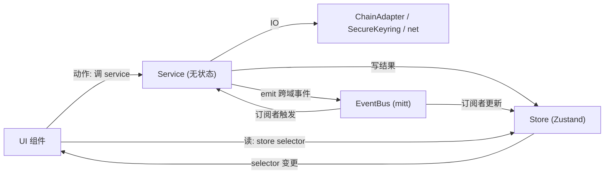

# TronLink RN · 状态层设计（轻量版 MetaMask 解耦）

> 输出日期：2026-06-08
> 适用：`tronlink-rn`，进入 **App UI 阶段（Phase 3+）** 时引入。
> 现状：`src/` 已有 `chain-registry / chain-adapter / native-bridge / crypto / evm / net / multichain / dapp`（地基 + adapter + DApp），**尚无状态层**——这符合 Phase 0/1/2 进度。本文定义状态层怎么补。
> 参考：`~/docs/multichain/metamask-mobile-architecture-detailed.md`（Controller/Service/Messenger 关系）、`~/docs/multichain/tronlink-rn-implementation-architecture.md`（总架构）。

---

## 0. 一句话原则

> **借 MetaMask 的「解耦纪律」，不借它的「重型机器」。**
> 三个角色：**Store（有状态，≈Controller）+ Service（无状态干活，≈Service）+ EventBus（轻量总线，≈Messenger）**。
> 用 **Zustand store + 普通 Service 类(依赖注入) + 一个类型化 mitt 总线** 落地，**不上** BaseController / 受限 Messenger 白名单 / Redux-Saga / Snaps。

---

## 1. 三角色映射（MetaMask → tronlink-rn 轻量版）

| MetaMask | 本项目轻量版 | 落地 |
|---|---|---|
| Controller（有状态，投影 Redux） | **Store** | Zustand store（每域一个） |
| Service（无状态，IO/检测/路由） | **Service** | 普通 class/函数 + 构造注入依赖 |
| Messenger（actions/events 总线） | **EventBus** | 类型化 `mitt`（pub/sub）+ 直接读 store |
| 受限 messenger 白名单 | —（省略） | 用 import 边界 + 单一所有权约定替代 |
| `*-controller-init` + DI | **container.ts** | 一处构造 service、注入 store/bus/adapter |
| reselect selector | Zustand selector | `useStore(s => s.x)` |
| `stateChange` → Redux | Zustand 内建订阅 | store 变更自动触发 UI |
| Snaps 沙箱 | —（不需要） | 用 `ChainAdapter + TWCore CoinType` 达成「加链不改核心」 |

> 选 **Zustand** 而非 Redux Toolkit：样板少、hooks 原生、selector 订阅天然对齐 MetaMask 的「UI 只读 selector」纪律，适合 RN 单进程。团队若偏好 RTK 亦可，角色划分不变。

---

## 2. 目录结构（在现有 `src/` 上新增）

```
src/
  state/
    stores/        # ≈Controller：有状态，单一所有权
      WalletStore.ts        # 账户树/当前账户/锁定态
      NetworkStore.ts       # 当前链 caip2 + per-chain 选中节点
      AssetsStore.ts        # 余额/代币/价格（按 caip2+address）
      TxStore.ts            # pending/历史交易
      DappStore.ts          # 已连接站点/权限（按 caip2）
      SettingsStore.ts      # 语言/币种/测试网开关等
    services/      # ≈Service：无状态，干活，写 store / emit 事件
      KeyringService.ts     # 唯一封装 native-bridge(SecureKeyring)
      BalanceService.ts     # 调 adapter.getBalance → 写 AssetsStore
      BroadcastService.ts   # 调 adapter.broadcast(net) → emit tx/submitted
      TxStatusService.ts    # 轮询确认 → 更新 TxStore + emit tx/confirmed
      NodeService.ts        # RPC/节点选择(读 NetworkStore + chain-registry)
      PriceService.ts       # 行情
      DappRequestService.ts # dapp/evmRequestRouter 的有状态编排(权限/确认)
    bus/
      events.ts             # 类型化事件表(AppEvents)
      eventBus.ts           # mitt 实例 + typed on/off/emit
    container.ts            # DI：构造所有 service，注入 store/bus/adapter
```

> 现有的 `chain-adapter / native-bridge / net / chain-registry / multichain` **不动**——状态层**坐在它们之上**编排。Service 调 Adapter/Bridge/net，把结果写进 Store 或 emit 事件。

---

## 3. 单向数据流（照搬 MetaMask 纪律）



**三条铁律（解耦的本质，来自 MetaMask）：**
1. **UI 读状态只走 store selector**，绝不直接调 service 拿状态。
2. **Service 无状态**：不持有自己的业务状态，只「读 store / 写 store / emit 事件 / 调 IO」。
3. **单一所有权**：每块状态由**唯一**一个 store 拥有；跨域用 EventBus 通知，不互相 `import` 造成环。

---

## 4. 关键代码骨架

### 4.1 类型化事件总线（≈Messenger，~极简）

`src/state/bus/events.ts`
```typescript
export type AppEvents = {
  'wallet/added': { walletRef: string };
  'wallet/locked': undefined;
  'account/selected': { caip10: string };
  'chain/switched': { caip2: string };
  'tx/submitted': { caip2: string; hash: string };
  'tx/confirmed': { caip2: string; hash: string; success: boolean };
  'dapp/connected': { origin: string; caip2: string };
};
```

`src/state/bus/eventBus.ts`
```typescript
import mitt from 'mitt';
import type { AppEvents } from './events';
export const bus = mitt<AppEvents>(); // bus.on('chain/switched', cb) / bus.emit('chain/switched', { caip2 })
```

> 这就是「Messenger」的轻量替身：**类型化 pub/sub**。没有白名单机制——靠「单一所有权 + import 边界」约束，足够 RN 单进程用。

### 4.2 Store（≈Controller，有状态）

`src/state/stores/NetworkStore.ts`
```typescript
import { create } from 'zustand';

interface NetworkState {
  selectedCaip2: string;
  nodeByChain: Record<string, string>;   // per-chain 选中节点(对应 Extension chainSelectedNode)
  setChain(caip2: string): void;
  setNode(caip2: string, node: string): void;
}

export const useNetworkStore = create<NetworkState>((set) => ({
  selectedCaip2: 'tron:728126428',
  nodeByChain: {},
  setChain: (caip2) => set({ selectedCaip2: caip2 }),
  setNode: (caip2, node) => set((s) => ({ nodeByChain: { ...s.nodeByChain, [caip2]: node } })),
}));
```

`src/state/stores/AssetsStore.ts`（按 `caip2:address` 存余额，bigint）
```typescript
import { create } from 'zustand';

type Key = `${string}:${string}`; // `${caip2}:${address}`
interface AssetsState {
  nativeBalance: Record<Key, bigint>;
  setNativeBalance(caip2: string, address: string, v: bigint): void;
}
export const useAssetsStore = create<AssetsState>((set) => ({
  nativeBalance: {},
  setNativeBalance: (caip2, address, v) =>
    set((s) => ({ nativeBalance: { ...s.nativeBalance, [`${caip2}:${address}`]: v } })),
}));
```

### 4.3 Service（≈Service，无状态，DI，写 store / emit）

`src/state/services/KeyringService.ts`（**唯一**封装 native 桥）
```typescript
import SecureKeyring from '../../native-bridge/NativeSecureKeyring';
import { bus } from '../bus/eventBus';

export class KeyringService {
  async importMnemonic(mnemonic: string): Promise<string> {
    const walletRef = await SecureKeyring.importMnemonic(mnemonic);
    bus.emit('wallet/added', { walletRef });
    return walletRef;        // 句柄；私钥留原生
  }
  deriveAddress(walletRef: string, coinType: number) {
    return SecureKeyring.deriveAddress(walletRef, coinType);
  }
  // 签名仍由 ChainAdapter 经 SecureKeyring.signHash 走；Service 不直接碰私钥
}
```

`src/state/services/BalanceService.ts`（无状态，注入依赖，写 store）
```typescript
import { getAdapter } from '../../chain-adapter/getAdapter';
import { useAssetsStore } from '../stores/AssetsStore';

export class BalanceService {
  async refreshNative(caip2: string, address: string): Promise<void> {
    const adapter = getAdapter(caip2);
    const bal = await adapter.getNativeBalance(address);   // 调现有 adapter
    useAssetsStore.getState().setNativeBalance(caip2, address, bal); // 写 store
  }
}
```

`src/state/services/BroadcastService.ts`
```typescript
import { getAdapter } from '../../chain-adapter/getAdapter';
import { bus } from '../bus/eventBus';

export class BroadcastService {
  async send(caip2: string, signedRawTx: string): Promise<string> {
    const adapter = getAdapter(caip2);               // SigningChainAdapter
    const hash = await adapter.broadcast(signedRawTx); // 现有 HTTPS 广播
    bus.emit('tx/submitted', { caip2, hash });
    return hash;
  }
}
```

### 4.4 DI 容器（≈Engine 的 init 装配，一处接线）

`src/state/container.ts`
```typescript
import { KeyringService } from './services/KeyringService';
import { BalanceService } from './services/BalanceService';
import { BroadcastService } from './services/BroadcastService';
import { TxStatusService } from './services/TxStatusService';
import { bus } from './bus/eventBus';

export function createContainer() {
  const keyring = new KeyringService();
  const balance = new BalanceService();
  const broadcast = new BroadcastService();
  const txStatus = new TxStatusService();

  // 跨域接线（订阅事件）：广播后开始轮询确认
  bus.on('tx/submitted', ({ caip2, hash }) => txStatus.track(caip2, hash));

  return { keyring, balance, broadcast, txStatus };
}
export const container = createContainer(); // App 启动时构造一次
```

> 对应 MetaMask 的 `controllerInitFunctions` + `initModularizedControllers`：**一处构造、注入依赖、订阅跨域事件**，但只有几十行,无白名单机器。

---

## 5. 状态/服务清单（按域，对照功能点）

| 域 | Store（有状态） | Service（无状态） |
|---|---|---|
| 账户/密钥 | `WalletStore`（账户树/当前账户/锁定态） | `KeyringService`（封装 native 桥） |
| 网络 | `NetworkStore`（当前 caip2 + per-chain 节点） | `NodeService`（节点选择/健康） |
| 资产 | `AssetsStore`（余额/代币/价格） | `BalanceService` · `PriceService` |
| 交易 | `TxStore`（pending/历史） | `BroadcastService` · `TxStatusService` |
| DApp | `DappStore`（连接站点/权限） | `DappRequestService`（编排 evmRequestRouter + 确认 UI） |
| 设置 | `SettingsStore` | —（纯状态） |

> 签名仍由 `chain-adapter`（`EvmSigningAdapter.sign` → `SecureKeyring.signHash`）承担，**不在 Service 里另起一套**——Service 只编排，不碰密码学。

---

## 6. 明确不做的（克制清单）

| ❌ 不引入 | 原因 |
|---|---|
| BaseController / 受限 Messenger 白名单 | RN 单进程，过重；用 store + import 边界足够 |
| Redux + Redux-Saga 样板 | Zustand 更省;副作用放 Service 即可（团队偏好 RTK 也行） |
| 每控制器一个 messenger 文件 | 不需要;一个 typed bus 够用 |
| Snaps 沙箱运行时 | 加链靠 `ChainAdapter + TWCore CoinType`，核心不改 |
| 独立 background 进程 / 状态投影层 | RN 单进程，Store 即 UI 状态源，无需"投影" |

---

## 7. 引入顺序（YAGNI，别一次铺满）

| 步骤 | 何时 | 内容 |
|---|---|---|
| 1 | 做第一个有状态 UI 时 | 建对应 **Store**（如 Wallet/Network/Assets）+ 用 adapter 填充 |
| 2 | 出现 IO/编排 | 抽 **Service**（Balance/Broadcast…），DI 注入，写 store |
| 3 | 出现**跨域**联动 | 才引入 **EventBus**（如「广播→轮询确认」「切链→刷新余额」） |
| 4 | App 启动装配 | `container.ts` 一处构造 + 接线 |

> 不要在没有跨域需求时就先建 bus——**先 Store，再 Service，最后才 Bus**。

---

## 8. 测试策略（DI 让它简单）

- **Store**：纯函数式断言（set→get），无需 mock。
- **Service**：构造时注入 mock 依赖（adapter/bridge/store），断言「写了正确 store / emit 了正确事件」。
- **EventBus**：emit→断言订阅者被调用。
- 与现有 `*.test.ts`（adapter/crypto/evm）一致，继续 Jest。

---

## 9. 一页结论

> **状态层 = Zustand Store（有状态，≈Controller）+ 无状态 Service（IO/编排，≈Service）+ 类型化 mitt EventBus（跨域通知，≈Messenger）+ container.ts（DI 装配，≈Engine init）。**
> 借 MetaMask 的**单向数据流 + 单一所有权 + DI 装配 + UI 只读 selector**纪律；**不上** BaseController/受限 Messenger/Saga/Snaps。
> 签名/广播继续复用现有 `chain-adapter`，Service 只编排不碰密码学。**先 Store→再 Service→最后 Bus，按需引入。**

---

## Status (2026-06-09): foundation built

### Implemented

- `EventBus` (`src/state/bus/eventBus.ts` + `events.ts`) — typed mitt pub/sub, 6 event types
- Stores: `NetworkStore`, `AssetsStore`, `WalletStore`, `TxStore`
- Services: `KeyringService`, `BalanceService`, `BroadcastService`, `TxStatusService`
- `container.ts` — DI assembly: constructs all services, wires `tx/submitted → TxStatusService.track`

### On-device verified (both platforms)

Task 7 (`src/devtools/StateLayerSelfTest.ts`) ran an end-to-end round-trip probe in Hermes on both platforms with `STATELAYER_RESULT=ALL_PASS`:
- Container constructs (zustand + mitt initialise in Hermes)
- `KeyringService.importMnemonic` → bus delivers `wallet/added` event
- `WalletStore.setWallet` write/read round-trip (3 chains, unlocked)
- `BalanceService.refreshNative` → `AssetsStore` populated

All 4 prior probes (SELFTEST / READONLY / EVMSIGN / TRONSIGN) remain `ALL_PASS` — no regression.

### Deferred (per §7 YAGNI)

`SettingsStore`, `DappStore`, `PriceService`, `DappRequestService`, `NodeService`, real `TxStatusService` polling loop, UI components.
